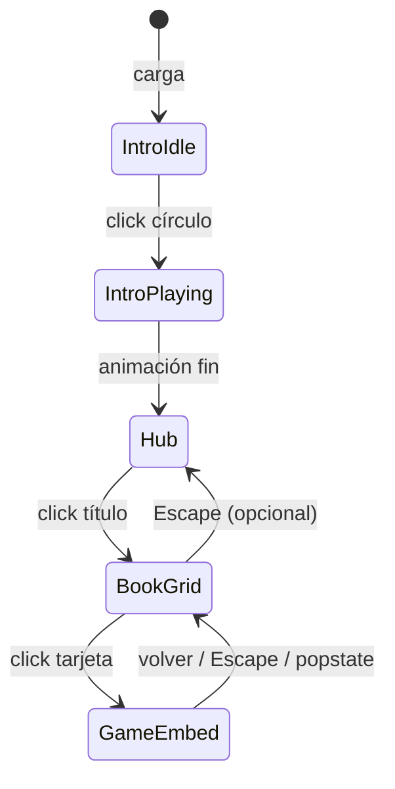

# Plan de implementación — Childhood Dreams Hub

> **Uso:** Ejecutar en **modo Agent** fase por fase. Marcar cada ítem `[x]` al completarlo.  
> **Objetivo:** SPA estática lista para Netlify: intro por click, hub de 4 juegos con iframe itch.io bajo demanda, assets optimizados, CSS/JS modular, móvil-first.

---

## Resumen ejecutivo

| Área | Acción |
|------|--------|
| Estructura | Separar HTML, CSS modular, JS modular, SVG externo |
| Intro | Click en círculo → halo + explosión → hub (timeline relativa al evento) |
| Juegos | Overlay fullscreen + 1 iframe lazy; mapa centralizado de embeds itch.io |
| Routing | Hash `#/juego/:id` + `history` para compartir y botón atrás |
| Móvil | `dvh`, safe-area, touch feedback, reducir animaciones pesadas |
| Deploy | `netlify.toml`, `_headers`, `.gitignore`, README deploy |

---

## Estructura de archivos objetivo

```
Childhood Dreams/
├── index.html                 # Solo markup semántico (~200 líneas)
├── netlify.toml
├── _headers
├── .gitignore
├── README.md
├── PLAN-DEPLOY.md             # Este archivo
├── css/
│   ├── main.css               # @import de todos los parciales
│   ├── base.css
│   ├── background.css
│   ├── intro.css
│   ├── hub.css
│   ├── books.css
│   ├── game-overlay.css
│   └── responsive.css
├── js/
│   ├── main.js                # entry: init de todos los módulos
│   ├── config.js              # GAMES, ITCH_EMBEDS, timings
│   ├── intro.js
│   ├── audio.js
│   ├── navigation.js          # pantallas + hash routing
│   └── games.js               # iframe lazy load
├── assets/
│   ├── particles.svg          # SVG de fondo (extraído del HTML)
│   ├── libro-1.webm … libro-4.webm
│   └── audio/
│       ├── ambient.mp3
│       ├── hover-title.mp3
│       ├── hover-card.mp3
│       └── click.mp3
└── thecreator2.svg / thecreator3.svg  # (existentes, sin tocar salvo uso futuro)
```

---

## Fase 0 — Preparación y saneamiento

**Objetivo:** Repo coherente antes de refactorizar.

### 0.1 Inventario de assets
- [ ] Verificar que existen localmente: `assets/libro-{1..4}.webm`, `assets/audio/*.mp3`
- [ ] Si faltan en git: añadir `.gitignore` que **no** ignore `assets/` (solo `node_modules`, `.DS_Store`, etc.)
- [ ] Documentar en README tamaños aproximados y recomendación Git LFS si algún webm > 50 MB

### 0.2 Eliminar referencias rotas
- [ ] Quitar `<link href="styles.css">` duplicado hasta que exista el archivo real
- [ ] Quitar `<script src="scripts.js">` vacío hasta que exista `js/main.js`
- [ ] Eliminar clase JS `books-ready` (sin CSS) o implementar su uso real

### 0.3 Limpieza HTML
- [ ] Eliminar bloque CSS duplicado de `.second-screen` (mantener solo z-index: 3)
- [ ] Corregir comentario roto en keyframes (`/* Respiración .intro-core {`)
- [ ] Unificar indentación de `.intro-core` / `.intro-shockwave`

**Criterio de aceptación:** `index.html` abre sin 404 en Network para CSS/JS (tras Fase 1).

---

## Fase 1 — Extracción de CSS

**Objetivo:** ~710 líneas de `<style>` → archivos modulares enlazados con `css/main.css`.

### 1.1 Crear parciales
| Archivo | Contenido |
|---------|-----------|
| `base.css` | `*`, `html`, `body`, transiciones globales, `prefers-reduced-motion` |
| `background.css` | `.particle-background`, estados invert en `second-screen-active` |
| `intro.css` | `.intro-overlay`, `.intro-core`, `::before` halo, shockwave, burst, keyframes intro |
| `hub.css` | `.content`, `.animated-title`, `.subtitle`, `titleFade`, estados `title-visible` |
| `books.css` | `.second-screen`, `.books-grid`, `.book-card`, videos, float keyframes |
| `game-overlay.css` | `.game-screen`, iframe, botón volver (Fase 4) |
| `responsive.css` | `@media (max-width: 720px)`, safe-area, `dvh` |

### 1.2 `main.css`
```css
@import "./base.css";
@import "./background.css";
@import "./intro.css";
@import "./hub.css";
@import "./books.css";
@import "./game-overlay.css";
@import "./responsive.css";
```

### 1.3 Actualizar `index.html`
- [ ] Un solo `<link rel="stylesheet" href="css/main.css">`
- [ ] Eliminar bloque `<style>` completo

**Criterio de aceptación:** Apariencia visual idéntica a la actual en desktop 1920×1080 y móvil 390×844.

---

## Fase 2 — Extracción de SVG de fondo

**Objetivo:** Reducir peso del HTML y permitir caché del fondo.

### 2.1 Extraer
- [ ] Copiar SVG inline (viewBox 1440×900 + animaciones) a `assets/particles.svg`
- [ ] En HTML: `<div class="particle-background">`  
  **O** `<object data="assets/particles.svg" type="image/svg+xml" aria-hidden="true">`
- [ ] Ajustar selectores CSS: `.particle-background svg` → `.particle-background img` o `object svg` según método

### 2.2 Optimización móvil (responsive.css)
- [ ] En `max-width: 720px`: opción A — `prefers-reduced-motion: reduce` desactiva `animateMotion` vía clase `body.reduce-motion`  
- [ ] Opción B — SVG estático sin animaciones para móvil (archivo `particles-static.svg` ligero)

**Criterio de aceptación:** Fondo visible; transición invert al entrar al grid funciona.

---

## Fase 3 — Intro por click (círculo / halo)

**Objetivo:** El usuario **debe pulsar** el círculo para iniciar halo, explosión y secuencia.

### 3.1 CSS — estado pausado
- [ ] `body.intro-idle` (reemplaza arranque automático):
  - `.intro-core`, `.intro-shockwave`, `.intro-burst-particles span` → `animation: none` o `paused`
  - Halo visible en reposo: `.intro-core::before` con opacidad suave pulsante opcional (`@keyframes haloPulse` 2s infinite)
- [ ] `body.intro-playing` → animaciones activas (como ahora)
- [ ] `.intro-overlay` en idle: `pointer-events: auto`
- [ ] `.intro-core`: `cursor: pointer`, área táctil mínima 88×88px

### 3.2 HTML — accesibilidad
```html
<div class="intro-overlay" id="introOverlay">
  <button type="button" class="intro-core" id="introTrigger"
    aria-label="Toca para comenzar">
  </button>
  <!-- shockwave + burst particles -->
  <p class="intro-hint" aria-live="polite">Toca el círculo</p>
</motion>
```
- [ ] Hint visible solo en `intro-idle`; ocultar al empezar

### 3.3 JS — `js/intro.js`
```javascript
// Pseudocódigo
const TIMELINE = {
  particlesVisible: 5750,  // ms desde intro-started
  introFadeout: 6500,
  titleVisible: 7600,
  removeOverlay: 9200,
};

export function initIntro({ onComplete, onStart }) {
  const trigger = document.getElementById('introTrigger');
  let startedAt = null;

  function startIntro() {
    if (startedAt) return;
    startedAt = performance.now();
    document.body.classList.remove('intro-idle');
    document.body.classList.add('intro-playing');
    onStart?.(); // unlock audio
    scheduleTimeline(startedAt);
  }

  trigger.addEventListener('click', startIntro);
  trigger.addEventListener('keydown', (e) => {
    if (e.key === 'Enter' || e.key === ' ') { e.preventDefault(); startIntro(); }
  });
}
```
- [ ] Reemplazar `setTimeout` fijos del DOMContentLoaded por tiempos relativos a `startedAt`
- [ ] `prefers-reduced-motion`: saltar a `title-visible` en < 500ms, sin explosión

### 3.4 Body classes iniciales
- [ ] Cambiar `<body class="intro-playing">` → `<body class="intro-idle">`
- [ ] Partículas ocultas hasta `particles-visible` (igual que ahora)

**Criterio de aceptación:** Sin click, la intro no avanza. Un click dispara toda la secuencia. Segundo click ignorado.

---

## Fase 4 — Extracción de JS y audio

### 4.1 `js/config.js`
```javascript
export const GAMES = [
  {
    id: 'le-petit-colonel',
    title: 'Le Petit Colonel',
    cardIndex: 1,
    itchEmbed: 'https://itch.io/embed/XXXXXX?border_width=0&bg_color=ffffff',
    // itchPage: 'https://usuario.itch.io/le-petit-colonel' // fallback
  },
  { id: 'momo-time-huntress', title: 'Momo Time Huntress', cardIndex: 2, itchEmbed: '...' },
  { id: 'peter-time-junky', title: 'Peter Time Junky', cardIndex: 3, itchEmbed: '...' },
  { id: 'alice-in-crazyland', title: 'Alice In Crazyland', cardIndex: 4, itchEmbed: '...' },
];
```
- [ ] **PLACEHOLDER:** sustituir `XXXXXX` por IDs reales desde panel itch.io → Embed game

### 4.2 `js/audio.js`
- [ ] Mover `configureAudio`, `unlockAudio`, `playSound`
- [ ] Exportar `initAudio()` — listeners `pointerdown`/`keydown` once
- [ ] Conectar en intro `onStart` → `unlockAudio()`
- [ ] Título: `mouseenter` / `focus` → `titleHoverAudio`
- [ ] Tarjetas: `mouseenter` + `pointerenter` → `cardHoverAudio`; `click` → `clickAudio`

### 4.3 `js/navigation.js`
- [ ] `goToSecondScreen()` — clase `second-screen-active`
- [ ] `goToHub()` — quitar `second-screen-active` + cerrar juego si abierto
- [ ] Escape: si juego abierto → cerrar juego; si no, si en grid → volver a hub título (opcional, documentar comportamiento)

### 4.4 `js/main.js`
```javascript
import { initIntro } from './intro.js';
import { initAudio } from './audio.js';
import { initNavigation } from './navigation.js';
import { initGames } from './games.js';

document.addEventListener('DOMContentLoaded', () => {
  initAudio();
  initIntro({ onStart: () => window.__audioUnlock?.() });
  initNavigation();
  initGames();
});
```

### 4.5 `index.html`
- [ ] `<script type="module" src="js/main.js"></script>` al final del body

**Criterio de aceptación:** Sin regresiones de audio; hover/click en tarjetas suenan tras primera interacción.

---

## Fase 5 — Capa de juego (iframe itch.io)

**Objetivo:** Un solo iframe; carga lazy; memoria liberada al cerrar.

### 5.1 HTML — overlay
```html
<section class="game-screen" id="gameScreen" hidden aria-hidden="true">
  <header class="game-screen-bar">
    <button type="button" id="gameBack" class="game-back">
      ← Volver
    </button>
    <h2 class="game-title" id="gameTitle"></h2>
    <button type="button" id="gameFullscreen" class="game-fullscreen" hidden>
      Pantalla completa
    </button>
    <a id="gameOpenExternal" class="game-external" target="_blank" rel="noopener">
      Abrir en itch.io
    </a>
  </header>
  <div class="game-frame-wrap">
    <iframe id="gameFrame" title="" allow="fullscreen; gamepad; autoplay" loading="lazy"></iframe>
  </motion>
</section>
```

### 5.2 CSS — `game-overlay.css`
- [ ] `position: fixed; inset: 0; z-index: 10000`
- [ ] Altura iframe: `height: calc(100dvh - var(--game-bar-height))` con fallback `100vh`
- [ ] `padding: env(safe-area-inset-*)` en barra superior
- [ ] Botones táctiles min 44×44px
- [ ] Estado `body.game-active` oculta grid / bloquea scroll del hub

### 5.3 JS — `js/games.js`
```javascript
export function initGames() {
  const frame = document.getElementById('gameFrame');
  const screen = document.getElementById('gameScreen');

  function openGame(game) {
    frame.title = game.title;
    frame.src = game.itchEmbed;
    document.getElementById('gameTitle').textContent = game.title;
    screen.hidden = false;
    document.body.classList.add('game-active');
    history.pushState({ game: game.id }, '', `#/juego/${game.id}`);
  }

  function closeGame() {
    frame.src = ''; // CRÍTICO: liberar memoria
    screen.hidden = true;
    document.body.classList.remove('game-active');
    history.pushState(null, '', '#');
  }

  document.querySelectorAll('.book-card').forEach((card, i) => {
    card.addEventListener('click', (e) => {
      e.preventDefault();
      openGame(GAMES[i]);
    });
  });

  document.getElementById('gameBack').addEventListener('click', closeGame);
  window.addEventListener('popstate', handleRoute);
}
```

### 5.4 Tarjetas HTML
- [ ] Cambiar `href="#experiencia-N"` → `href="#/juego/{id}"` según `config.js`
- [ ] `data-game-id` en cada `.book-card` para routing

### 5.5 Hash routing — ampliar `navigation.js`
- [ ] Al cargar: parsear `location.hash` → si `#/juego/:id`, abrir juego tras intro completada (o guardar pending)
- [ ] `popstate` sincroniza overlay

### 5.6 Fallback móvil
- [ ] Si iframe no carga en 8s (`load` timeout): mostrar enlace “Abrir en itch.io” prominente
- [ ] API Fullscreen en botón opcional (`gameFrame.requestFullscreen`)

**Criterio de aceptación:** Click tarjeta → juego carga; volver → iframe vacío; URL compartible `#/juego/momo-time-huntress`.

---

## Fase 6 — Optimización de media y rendimiento

### 6.1 Videos del hub
- [ ] `preload="metadata"` (no `auto`) en los 4 webm
- [ ] `IntersectionObserver`: pausar video si tarjeta fuera de viewport
- [ ] Mantener `muted loop playsinline`

### 6.2 Audio
- [ ] `preload="metadata"` en hover sounds; `auto` solo en `click.mp3` si se desea

### 6.3 SVG / filtros
- [ ] Evaluar quitar `filter: invert(1)` en móvil → clase `body.light-theme` con colores nativos (fase opcional si hay tiempo)
- [ ] `will-change: transform` solo en elementos animados activos

### 6.4 Build opcional (prioridad baja)
- [ ] `package.json` con script `npm run build`:
  - `esbuild js/main.js --bundle --minify --outfile=dist/js/main.js`
  - `csso css/main.css -o dist/css/main.css`
- [ ] Si no hay build: Netlify sirve fuente directamente (válido)

**Criterio de aceptación:** Lighthouse móvil Performance ≥ 70 (objetivo orientativo); sin 4 iframes precargados.

---

## Fase 7 — Responsividad y accesibilidad

### 7.1 CSS responsive
- [ ] Breakpoint 720px: grid 1 col (ya existe, migrar a `responsive.css`)
- [ ] `@media (hover: none)`: estilos `:active` en tarjetas equivalentes al hover
- [ ] `font-size` con `clamp` conservado

### 7.2 Safe area y viewport
```html
<meta name="viewport" content="width=device-width, initial-scale=1.0, viewport-fit=cover" />
```
```css
.game-screen-bar {
  padding-top: max(0.75rem, env(safe-area-inset-top));
  padding-left: env(safe-area-inset-left);
  padding-right: env(safe-area-inset-right);
}
```

### 7.3 Accesibilidad
- [ ] `aria-hidden` dinámico en pantallas inactivas
- [ ] Focus trap opcional en game overlay (tab cicla entre volver y iframe)
- [ ] `prefers-reduced-motion` en intro y float de tarjetas

### 7.4 Pruebas manuales checklist
- [ ] iOS Safari — intro click, iframe, scroll grid
- [ ] Chrome Android — mismo
- [ ] Landscape en game overlay
- [ ] Escape cierra juego
- [ ] Teclado: Enter en título → grid; Enter en tarjeta → juego

---

## Fase 8 — Deploy Netlify

### 8.1 `netlify.toml`
```toml
[build]
  publish = "."
  # command = "npm run build"  # descomentar si Fase 6.4 build activo
  # publish = "dist"

[[headers]]
  for = "/*"
  [headers.values]
    X-Frame-Options = "SAMEORIGIN"
    X-Content-Type-Options = "nosniff"
    Referrer-Policy = "strict-origin-when-cross-origin"

[[headers]]
  for = "/assets/*"
  [headers.values]
    Cache-Control = "public, max-age=31536000, immutable"

[[headers]]
  for = "/css/*"
  [headers.values]
    Cache-Control = "public, max-age=86400"

[[headers]]
  for = "/js/*"
  [headers.values]
    Cache-Control = "public, max-age=86400"
```

### 8.2 `_headers` (CSP para itch — ajustar si algo bloquea)
```
/*
  Content-Security-Policy: default-src 'self'; script-src 'self' 'unsafe-inline'; style-src 'self' 'unsafe-inline'; img-src 'self' data:; media-src 'self'; frame-src https://itch.io https://*.itch.io https://*.itch.zone https://html-classic.itch.zone; connect-src 'self'; font-src 'self' data:;
```
- [ ] Probar embed real; relajar CSP solo si DevTools muestra bloqueo

### 8.3 `_redirects` (SPA hash — opcional)
```
/*    /index.html   200
```
- [ ] Necesario solo si en futuro usas rutas sin `#`

### 8.4 `.gitignore`
```
node_modules/
dist/
.DS_Store
Thumbs.db
*.log
.env
```

### 8.5 `README.md` — sección Deploy
- [ ] Pasos: conectar repo GitHub → Netlify → publish `.`
- [ ] Variables: ninguna obligatoria
- [ ] Cómo actualizar URLs itch en `js/config.js`
- [ ] Dominio custom opcional

**Criterio de aceptación:** Deploy preview Netlify carga sin 404; un juego embed funciona en producción.

---

## Fase 9 — Documentación y polish final

### 9.1 README
- [ ] Descripción del hub
- [ ] Estructura de carpetas
- [ ] Cómo añadir un quinto juego
- [ ] Checklist pre-deploy

### 9.2 Meta / SEO mínimo
```html
<meta name="description" content="Childhood Dreams — hub de experiencias interactivas" />
<meta property="og:title" content="Childhood Dreams" />
<meta property="og:type" content="website" />
<!-- og:image cuando exista captura -->
```

### 9.3 PWA opcional (prioridad baja)
- [ ] `manifest.webmanifest` + iconos 192/512
- [ ] No bloqueante para v1

### 9.4 Eliminar archivos temporales
- [ ] Borrar `Untitled` si solo contenía el diagrama mermaid (migrar diagrama a README o este plan)

---

## Orden de ejecución en Agent (recomendado)

```
Fase 0 → Fase 1 → Fase 2 → Fase 3 → Fase 4 → Fase 5 → Fase 6 → Fase 7 → Fase 8 → Fase 9
```

**Commits sugeridos** (si el usuario pide commit entre fases):
1. `refactor: extract CSS into modular files`
2. `refactor: extract SVG background and JS modules`
3. `feat: click-to-start intro sequence`
4. `feat: itch.io game overlay with hash routing`
5. `chore: netlify config and deploy docs`

---

## Diagrama de estados (referencia)



## Clases `body` — referencia rápida

| Clase | Significado |
|-------|-------------|
| `intro-idle` | Esperando click en círculo |
| `intro-playing` | Animación intro en curso |
| `particles-visible` | Fondo SVG visible |
| `intro-fadeout` | Overlay intro desvaneciéndose |
| `title-visible` | Título hub interactivo |
| `second-screen-active` | Grid de libros visible |
| `game-active` | Overlay iframe juego abierto |
| `reduce-motion` | (opcional) animaciones reducidas |

---

## Riesgos y mitigaciones

| Riesgo | Mitigación |
|--------|------------|
| itch.io bloquea embed | Enlace externo en `config.itchPage`; probar cada juego |
| iOS bloquea audio en iframe | Primer tap en hub desbloquea; hint “toca dentro del juego” |
| SVG object no hereda invert | Usar `` + CSS filter en contenedor o duplicar asset claro |
| Módulos ES6 en file:// | Servir con `npx serve .` o Netlify; no abrir HTML directo |
| Assets pesados en git | Git LFS o CDN; comprimir webm con ffmpeg |
| CSP bloquea itch | Ajustar `frame-src` en `_headers` tras prueba real |

---

## Checklist pre-deploy (Agent debe verificar)

- [ ] Sin `<style>` inline en index.html
- [ ] Sin `<script>` inline (salvo analytics futuro)
- [ ] `js/config.js` tiene 4 URLs itch reales (pedir al usuario si siguen placeholder)
- [ ] Un solo iframe en DOM
- [ ] Intro no avanza sin click
- [ ] `iframe.src = ''` al cerrar juego
- [ ] `netlify.toml` + `_headers` presentes
- [ ] README con instrucciones deploy
- [ ] Prueba móvil documentada en commit/PR

---

## Input requerido del usuario (bloqueante para Fase 5)

Antes de cerrar Fase 5, obtener de itch.io para cada juego:

1. URL de **Embed** (iframe)
2. URL de página pública (fallback)
3. Confirmar que embed está **habilitado** en configuración del proyecto itch

Pegar en `js/config.js` sustituyendo placeholders `XXXXXX`.

---

*Plan generado para implementación en modo Agent. Versión 1.0.*
